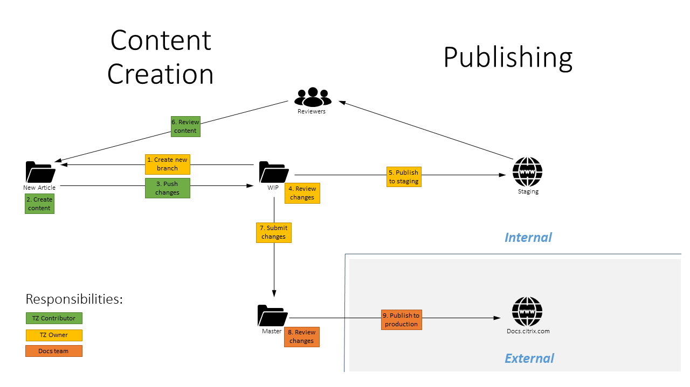

# Contributor Guidelines

Welcome to the documentation page for Citrix Tech Zone! We're delighted that you're interested in contributing to our site. If you need to reach our team, you can email us at tech-content-feedback@citrix.com (external email contact) or reach out directly to [Tarkan Kocoglu](mailto:tarkan.kocoglu@citrix.com) or [Martin Zugec](mailto:martin.zugec@citrix.com).

Before you start, we'd like to share the playbook and the rules for contributions.

Our site supports multi-channel output, including HTML, PDF, and screen readers, not to mention that the site design is responsive. Therefore, we've tuned the markdown requirements to ensure integrity of the output no matter which output type we're looking at. We've also locked down the markdown spec to ensure build integrity, dependability, and continuous deployment.

Besides the output considerations, we aim for readability. Keep your writing at a 9th or 10th grade (U.S.) reading level. The equivalent of a Flesch reading ease score of 60 or higher. This helps our fluent English-language readers to get what they need fast, without having to study. And it alleviates pain for our audience members who don't read English well, or who prefer another language.

## Authoring Content

Write your content in GitHub-flavored Markdown. For basic usage, we recommend to use web-based editor on our internally hosted Bitbucket site (code.citrite.net), as it provides user experience similar to writing a blog on Wordpress or similar platform. More advanced users can use Visual Studio Code (VSC) following our [Visual Studio Code Quick Tips](https://info.citrite.net/display/EngSharedSvcs/Visual+Studio+Code+Quick+Tips). If you use VSC, skip the step to install the Acrolinx plug-in. Acrolinx requires a named user license and it is not available to our team.

If you use VSC, we recommend installing the markdown validator. If the validator detects deviations from our markdown spec, you cannot commit your changes until those deviations are addressed.

## Style Guide and Quality Standards

All submissions are edited for compliance with the [Citrix Writing Style Guidelines](https://citrixbrand.imagerelay.com/share/758829b0fe0f4ef18bf897e52af734a7), [Citrix Terminology](https://citrix-terminology.knack.com/terminology), and the Microsoft Manual of Style, 4th Edition.

Our docs team is using an automated editing tool, Acrolinx, to identify issues and to correct them. When you submit your content for publication, one of our leads or managers checks the submission using Acrolinx. We make corrections based on Citrix terminology, style, and voice guidelines. Any significant changes (such as long sentences being rewritten) require technical review and verification.

When you link some content (link, YouTube video or images), make sure to always use HTTPS, not HTTP.

## Tables

Tables are generally discouraged for modern articles - it is complicated to maintain them in markdown, they have very limited functionality (e.g. markdown doesn't support bulletpoints in tables or multiple paragraphs) and articles with tables are penalized by search engines like Google or Bing (content is marked as not being mobile friendly). If you really need to include a table in your article, please use one of the many online generators (for example [this one](https://www.tablesgenerator.com/markdown_tables)).

## Images

Our readers love images, so include as many as you need to get your message across. If you are using web-based editor and need to include images, send them to Martin Zugec and include placeholders ("INSERT IMAGE" followed by image name) in your markdown file. For advanced users, all images must be placed in the /media folder of the Tech Zone repo. Our build looks for all images in that folder, so if your images are somewhere else, the build does not pick them up.

*  Use PNG format for images.
*  Maximum image width is 600 px
*  Maximum image size is 500 KB
*  File name is using format (category)_(article name)_(image name) with spaces replaced by hyphens ("-"). For example tech-briefs_workspace-app_overview.png. “Category” is identical to category section of URL (e.g. ‘’reference-architectures”) and “article name” is identical to filename of the article (.md file).
*  Underscore character (`_`) is used as delimiter and you should not use it in image name. Feel free to use hyphen in image name instead.
*  If possible, try to include sources (Visio or PowerPoint format) for your diagrams.

### Tips for avoiding repeated editing cycles

*  Keep your sentences short--26 words or fewer.
*  Use only approved and valid Citrix terms.
*  Write in a personal, friendly style. Do not use the style of academic discourse.
*  Write in present tense. For example, "the product reports the result" instead of "the product will report the result."
*  Make every word count. We get complaints from readers when the writing sounds too "markety". (The actual quotations are NSFW.)

## Most common mistakes

*  Be aware of trailing spaces
*  Make sure that headers are valid. Only title should be a level 1 header (prefixed by a single `#` character). Headers should never increment by more than one level (e.g. level 2 '##' header should not be followed by level 4 '####' header)
*  For lists, make sure that are 2 (not 1) spaces after '*' or '-' character
*  Make sure there are blank lines before and after lists and headers. Text should not start on the next line after header, there needs to be a blank line between header and text.

## Submit a Change or an Article to Tech Zone

Submitting a change to Tech Zone is an easy process and is similar to using a Wordpress or other publishing system. We are using markdown language, which is defacto industry standard for writing dynamic documentation.

Overview of Tech Zone content creation and publishing flow

1 Create a request at [#tm-techzone-build](https://citrix.slack.com/messages/CF7URLTU7) Slack channel for new article creation (just post a message). Specify document type (section) and article name. For example ask for "tech paper" category and "antivirus best practices" article title. Try to think about title that will be static (e. g. not change in future) and short. Title is used for publishing and URL (name of HTML file), actual title of article can be different.
2 Wait until you get an email or Slack message that your  branch has been created created for you. You will receive a custom URL that you can use to create / update your article.
3 After opening the link, make sure to confirm your branch name (in the upper left corner). If you are ready to make changes, click on `Show source` and `Edit` to switch to edit mode.
4 Create/update the content using provided URL. We are using markdown language, you can find many [cheatsheets](https://github.com/adam-p/markdown-here/wiki/Markdown-Cheatsheet) if needed. Feel free to make any number of commits ("saves") as you needed.
5 When you are done with your changes, select `Create a pull request for this change` in your commit dialog. For destination, select `wip` branch.
6 After PR is created, your article will be automatically check for markdown violations. If any violations are detected, you should receive an email with their list and instructions to fix them first.
7 Wait for request to be approved. After approval, your updated document should be available at [Citrix Docs Staging Environment](https://stage-docs.citrix.com/en-us).

## Information for moderators

Following tips are useful for operators, but are not important for authors / contributors.

### File Naming Standards

*  The file name ends up being the last part of the URL. Think how it will appear in search results pages.
*  Use whole words only.
*  Separate words with hyphens. Do not use underscores, unless file is picture, as this impacts SEO.
*  Do not include stopwords such as and, of, or, for, the, etc.
*  Make the file name human-readable.

### Branch Naming Standards

*  Branch name is in format of BranchType_Section_Name, for example new_tech-paper_windows-10-scalability
*  Branch type can be one of following: New | Update | Fix | Review. Fix is reserved for Git or platform related fixes (TOC, rollbacks etc.)
*  Section is referring to a folder name
*  Branch name can be any string of text, but should reflect the type of content that is being created

When we get your pull request, it's a quick process on our side to stage and publish your changes:

1 Review the diff between the pull request and the production branch of the repository.
2 Run Acrolinx on the submitted content to ensure compliance with corporate terminology, style, and voice guidelines.
3 Iterate with the submitter (if needed) to review changes required by edit.
4 Merge to `wip` branch. The `wip` (work in progress) branch is our staging branch. Anything merged to `wip` is automatically published to our [staging environment](https://stage-docs.citrix.com/en-us).
5 Merge to `master` branch. The `master` branch is our production branch. Anything merged to `master` is automatically published to our production site, (docs.citrix.com).
